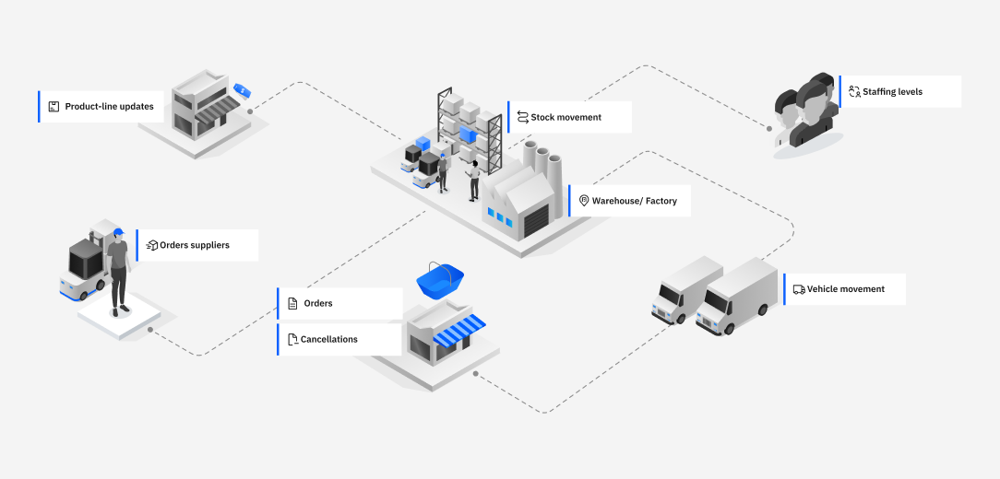

# IBM Event Automation demo

Ansible playbook for deploying an instance of IBM Event Automation, populated with events for use in demos.

## Overview

This repository contains a playbook for installing a demo environment of IBM Event Automation.

To help you start exploring the features, the playbook also populates the environment with topics and a data generator that creates a live stream of events that are ready to use.

These tutorial topics simulate aspects of a clothing retailer, with topics relating to sales, stock management, and employee activities.

Messages on the topics are consistent (for example, events on the topic for cancelled orders use order IDs that are used in events on the orders topic) to allow you to experiment with joining and correlating events from different topics. Some topics include events that are intentionally duplicated, delayed, or produced out of sequence, to allow you to learn how to use Event Automation to correctly process topics like this.



## Scope

This tutorial environment is not intended to demonstrate a production deployment. It is a quick and simple instance of Event Automation for learning some of the key features.

## Prerequisites

- In the target environment you deploy the demo to:

    - Red Hat OpenShift Container Platform

- Where you run the deployment playbook from:

    1. `ansible-playbook`

    2. `oc` - [logged in as a cluster administrator](https://docs.openshift.com/container-platform/4.12/cli_reference/openshift_cli/getting-started-cli.html#cli-logging-in_cli-developer-commands)

    3.  Entitlement key from the [IBM Container software library](https://myibm.ibm.com/products-services/containerlibrary).

---

## Step 1 - Deploy

A default install will deploy Event Automation without persistent storage.

```sh
ansible-playbook \
    -e license_accept=<true|false> \
    -e install_certmgr=<true|false> \
    -e ibm_entitlement_key=<Entitled Registry key> \
    -e eventautomation_namespace=event-automation \
    install/event-automation.yaml
```

### Options

#### `license_accept`

Set this to `true` to indicate that you accept the terms of the Event Automation license. This value is used for each of the components that the playbook installs.

#### `install_certmgr`

Event Automation requires a certificate manager operator to create and manage SSL/TLS certificates.

Set this to `true` if you don't already have an existing supported certificate manager operator and want the deployment playbook to install the IBM Cert Manager.

Otherwise, omit this value (or set it to `false`) to use your existing certificate operator.

#### `ibm_entitlement_key`

Set this to the key you created in the [IBM Container software library](https://myibm.ibm.com/products-services/containerlibrary).

#### `eventautomation_namespace`

Namespace to deploy the Event Automation components into.

#### `eventstreams_storage_class`

Storage class to use for persistent storage for Kafka brokers and ZooKeeper nodes from Event Streams.

If omitted, ephemeral storage is used.

#### `eventendpointmanagement_storage_class`

Storage class to use for the Event Endpoint Management manager.

If omitted, ephemeral storage is used.

#### `eventprocessing_storage_class`

Storage class to use for the Event Processing authoring environment.

If omitted, ephemeral storage is used.

### Example

For example, to deploy into a cluster from Red Hat OpenShift Kubernetes Service on IBM Cloud ("ROKS"), using persistent storage, you can run:

```sh
ansible-playbook \
    -e license_accept=true \
    -e ibm_entitlement_key=YOUR-KEY-HERE \
    -e install_certmgr=true \
    -e eventstreams_storage_class=ibmc-file-gold-gid \
    -e eventendpointmanagement_storage_class=ibmc-file-bronze-gid \
    -e eventprocessing_storage_class=ibmc-file-bronze-gid \
    -e eventautomation_namespace=event-automation \
    install/event-automation.yaml
```

### Advanced options

For more options, see [INSTALL-OPTIONS.md](./INSTALL-OPTIONS.md).

For details on how to customize the events produced by the data generator, see the documentation for [the data generator](https://github.com/IBM/kafka-connect-loosehangerjeans-source/).

---

## Step 2 - Populate the catalog

A helper script is provided to populate the Event Endpoint Management catalog with documentation for the tutorial Kafka topics.

This will allow you to discover the tutorial topics in the catalog.

`./eem-seed/reset-all-data.sh <eventautomation_namespace>`

For example:
```sh
./eem-seed/reset-all-data.sh event-automation
```

> **Warning**:
>
> This will delete ALL data stored in Event Endpoint Management (including cluster definitions, topic documentation, subscriptions), and replace it with documentation for the topics included in the tutorial.
>
> You should not run this script if you have any data in Event Endpoint Management that you want to keep.
>

---

## Step 3 - Try the tutorials

For instructions on how to start using your new demo environment, you can follow the [tutorial instructions in the IBM Event Automation documentation](https://ibm.biz/ea-tutorials).

